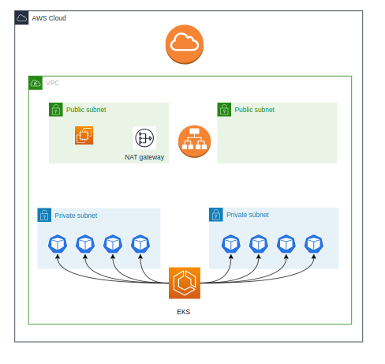
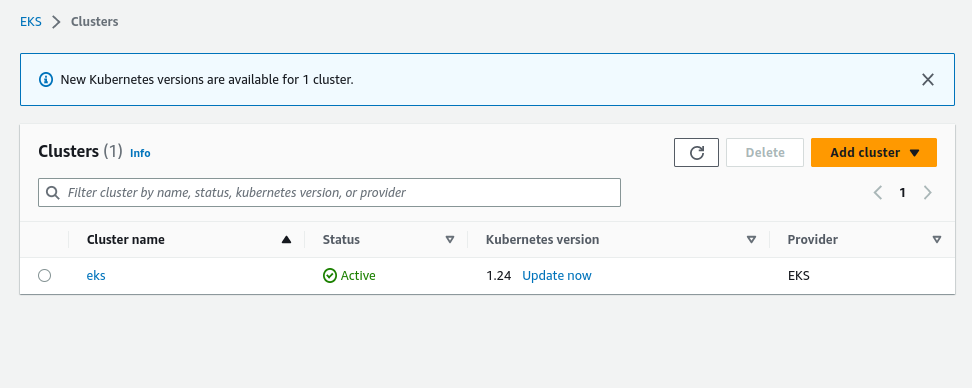
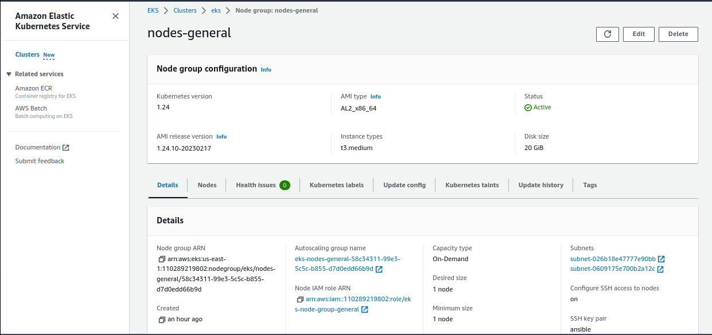
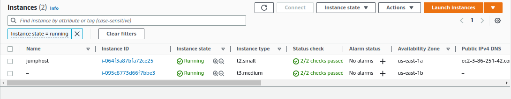
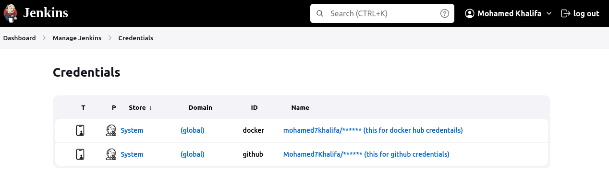
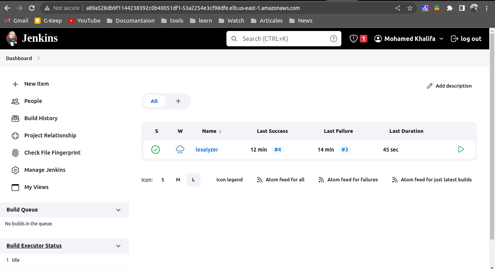
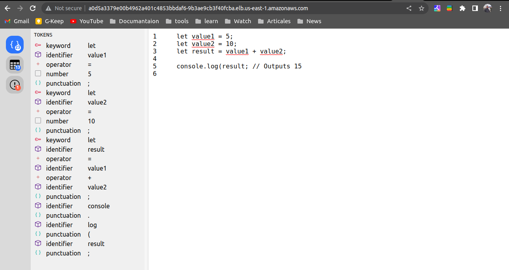
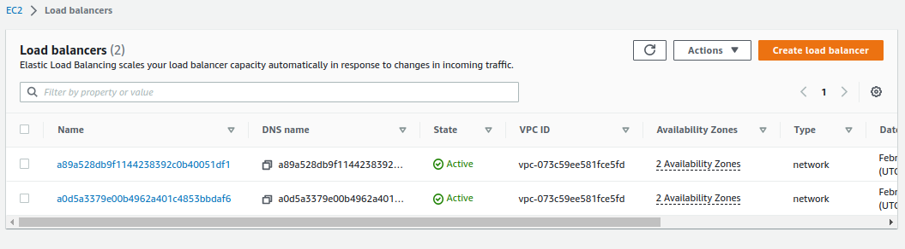

# Name
## Jenkins-CICD-K8s


# Description
- Infrastructure to create EKS cluster in aws totally private with terraform and access this cluster with bastion
- Ansible to configure the bastion
- K8s contain all the yaml files to create jenkins pods and its loadbalancer service in its own namespace and the app pods and loadbalancer pods in own namespace
- Deploy CI/CD to lexalyzer app which is web IDE project to check errors in javascript

# Tools used


# prerequisites
- must have terraform in local machine to apply the infrastructure 
- must have ansible in local machine to run the configuration
- Install aws cli to configure your credentials

# Installation

- clone this repo 
```bash
git clone https://github.com/Mohamed7Khalifa/final-project-iti
```

- initiate the terraform infrastructure 
```bash    
terraform init
```

- plan and apply the terraform infrastructure 

```bash    
terraform plan
terraform apply
```
**then this will create the infrastructure**






- configure the aws profile with cli and export your AWS_ACCESS_KEY_ID and AWS_SECRET_ACCESS_KEY as environment variables in .bashrc

- then run this command to run ansible configuration
```bash
ansible-playbook playbook.yaml -i inventory.ini 
```
**Note: the ansible also copy the jenkins deployment, service and jenkins-permission files to the bastion machine**

- ssh to your bastion machine and create jenkins deployment with specific image that contain jenkins within docker and kubectl on it
image:
```docker
FROM jenkins/jenkins:lts

USER root

# Install Docker
RUN apt-get update && \
    apt-get install -y apt-transport-https ca-certificates curl gnupg2 software-properties-common && \
    curl -fsSL https://download.docker.com/linux/debian/gpg | apt-key add - && \
    add-apt-repository "deb [arch=amd64] https://download.docker.com/linux/debian $(lsb_release -cs) stable" && \
    apt-get update && \
    apt-get install -y docker-ce-cli

# Install kubectl
RUN curl -LO "https://dl.k8s.io/release/$(curl -Ls https://dl.k8s.io/release/stable.txt)/bin/linux/amd64/kubectl" && \
    chmod +x kubectl && \
    mv kubectl /usr/local/bin/kubectl
```
kubectl commands to create jenkins image:
```bash
# create jenkins namespace
kubectl create ns jenkins-ns
# create service account, role and rolebinding 
kubectl create -f jenkins/jenkins-permission.yaml
# create jenkins deployment
kubectl create -f jenkins/deployment.yaml
# create jenkins loadbalancer service
kubectl create -f jenkins/service.yaml
```
**copy the loadbalancer external ip and put it with your browser to open jenkins**

to get the jenkins password
```bash
kubectl exec -it [pod_name] -n jenkins-ns bash
cat /var/jenkins_home/secrets/initialAdminPassword
```
example:
```bash
ubuntu@ip-192-168-19-244:~/jenkins$ kubectl exec -it jenkins-6d98d8b79b-vxrcg -n jenkins-ns bash
root@jenkins-6d98d8b79b-vxrcg:/ cat /var/jenkins_home/secrets/initialAdminPassword
4691db570bbe49bb8d188ca5b7717d87
```

**put the password in jenkins and create your own user and install the suggested plugin**

- then add your docker and github credentials to jenkins 


- create pipeline in jenkins and give it lexalyzer github and on it you will find jenkins file

Jenkinsfile:
```jenkins
pipeline {
    agent any

    stages {
        stage('CI') {
            steps {
                git 'https://github.com/mohannadzidan/lexalyzer.git'
                withCredentials([usernamePassword(credentialsId: 'docker', usernameVariable: 'USERNAME', passwordVariable: 'PASSWORD')]) {
                sh """
                docker login -u ${USERNAME} -p ${PASSWORD}
                docker build . -t mohamed7khalifa/lexalyzer:v1.1 --network host
                docker push mohamed7khalifa/lexalyzer:v1.1
                """
                }
            }
        }
         stage('CD') {
            steps {
                git 'https://github.com/mohannadzidan/lexalyzer.git'
                withCredentials([usernamePassword(credentialsId: 'docker', usernameVariable: 'USERNAME', passwordVariable: 'PASSWORD')]) {
                sh """
                kubectl apply -f /var/jenkins_home/workspace/lexalyzer/app/app.yaml
                kubectl apply -f /var/jenkins_home/workspace/lexalyzer/app/service-app.yaml
                """
                }
            }
        }
    }
}

```

**Build your pipeline**


**copy the loadbalancer dns to open lexalzer**



**loadbalancer dns for jenkins and lexalyzer**


# END
